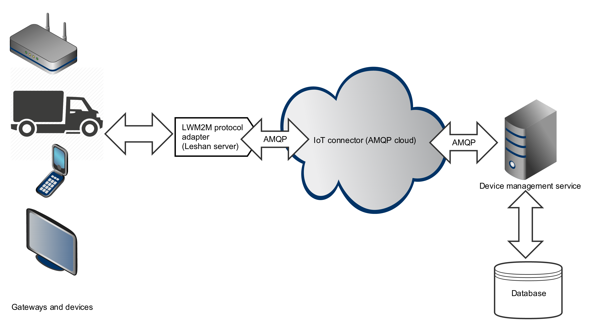

# Leshan (LWM2M) protocol adapter

[Leshan](https://projects.eclipse.org/projects/iot.leshan) is the
open source implementation of the [LWM2M](https://en.wikipedia.org/wiki/OMA_LWM2M) protocol. LWM2M becomes the standard
for the IoT devices management so we decided to make it a first-class citizen of Cloud Platform by providing the
Leshan protocol adapter.

Under the hood Leshan protocol adapter starts embedded Leshan server which allows devices to connect to the platform
using the LWM2M protocol. Leshan protocol adapter relies on AMQP-based device registry, so all the events generated
by the connected devices are forwarded to the [device management service](../services/device_management.md).

## Starting Leshan protocol adapter

This section describes how to start Leshan protocol adapter.

### Starting Leshan protocol adapter in a PaaS environment

PaaS distribution of Cloud Platform has Leshan protocol adapter included by default (listening on port 5683).

### Starting REST protocol adapter programatically in Spring runtime

In order to start Leshan protocol adapter in your Cloud Platform application, just add the following jar into your POM file.

    <dependency>
        <groupId>io.rhiot</groupId>
    	<artifactId>rhiot-cloudplatform-adapter-leshan</artifactId>
    	<version>${rhiot.version}</version>
    </dependency>

Spring Boot runtime automatically detects and starts Leshan protocol adapter as soon `CloudPlatform` instance is started:

    import io.rhiot.cloudplatform.runtime.spring.CloudPlatform;
    ...
    new CloudPlatform().start();

## Spring runtime Configuration

By default Leshan protocol adapter listens on HTTP port 5683. You can change this port by setting `leshan.port` property.