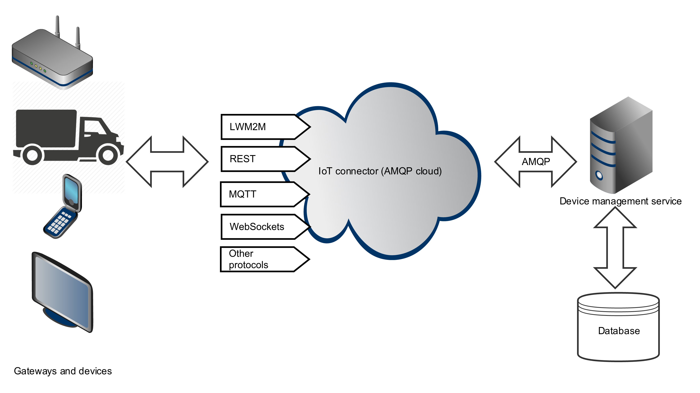

# Device management service

The foundation of the every IoT solution is the device management system. Without the centralized coordination of your
*things*, you can't properly orchestrate how your devices communicate with each other. Also the effective monitoring of
the IoT system, without the devices registered in the centralized cloud, becomes almost impossible. Rhiot provides
backend management service for registering and tracking devices connected to the Cloud Platform.

The diagram below presents the high-level overview of the device cloudlet architecture.

## Device management API

Device service can be accessed using the IoT connector API described below. Keep in mind that Protocol Adapters can
be used to access device management service via other protocols (including REST and LWM2M). Device schema describes
structure of the data consumed by device service. A device is represented using the following
schema:

    class Device {

        String deviceId;

        String registrationId;

        Date registrationDate;

        Date lastUpdate;

        String address;

        int port;

        InetSocketAddress registrationEndpointAddress;

        long lifeTimeInSec;

        List<LinkObject> objectLinks;

        Map<String, Object> properties;

    }

    class LinkObject {

        String url;

        Map<String, Object> attributes;

        Integer objectId;

        Integer objectInstanceId;

        Integer resourceId;

    }

Device service API jar provides DTO objects
representing schema. In order to use schema jar in your project include the following dependency in your POM
XML file:

    <dependency>
    	<groupId>io.rhiot</groupId>
    	<artifactId>hono-service-device-api</artifactId>
    	<version>${rhiot.version}</version>
    </dependency>

### Registering device

In order to register a device in a device service, send a definition of a former to the `device.register` channel:

    device -> device.register

Where `device` is an encoded object following the `Device` schema.

### Updating device metadata

In order to updated already registered device, send a definition of it to the `device.update` channel:

    device -> device.update

Where `device` is an encoded object following the `Device` schema. Keep in mind that `deviceId` and `registrationId`
fields of the encoded payload must match the corresponding values of the device registered in a device service.

### Listing devices

To list the devices registered to the cloud (together with their basic metadata) send empty message to the following
IoT Connector channel:

    device.list

As a response you will receive a list of the devices following the `Device` schema described above.

### Reading particular device's metadata

In order to read the metadata of the particular device identified with the given ID, send a message to following
IoT connector channel:

    String id -> device.get

Where ID is a String representing the unique ID of a device. As a response you will receive a device following the
`Device` schema described above.

If you would like to find device using its unique registration identified, assigned to it when device is connected to
the device service, the `device.getByRegistrationId` channel instead:

    String registrationID -> device.getByRegistrationId

### Disconnected devices

Registered devices can be in the *connected* or *disconnected* status. Connected devices can exchange
messages with the cloud, while disconnected can't. Disconnection usually occurs when device temporarily lost the network
connectivity.

To return the list of identifiers of the disconnected devices send an empty message to the following IoT connector channel:

    device.disconnected

In the response you will receive the list of the identifiers of the devices
that have not send the heartbeat signal to the device management service for the given *disconnection period* (one minute by
default).

### Sending heartbeat

The device which is running and operational should periodically send the hearbeat signal to the device service in order to avoid
being marked as disconnected. You can do it be sending a message to the following IoT connector channel:

    String id -> device.heartbeat

Where ID is a String representing the unique ID of a device.

Keep also in mind that sending the regular LWM2M update by the client device to the LWM2M Leshan protocol adapter sends
heartbeat update as well.

### Deregistering device

Sometimes you would like to explicitly remove a particular registered device from a device database. In such case
you can send a message to the following IoT connector channel:

    ADDRESS: device.deregister
    BODY: String id

Where `id`` is a String representing the unique ID of a device.

## Device registries

The information about devices is stored in a *device registry*. You can think of the registry as of central devices
database.

Device registries implements `org.eclipse.cloudplatform.service.device.api.DeviceRegistry` interface which is
located in the device API jar:

    <dependency>
    	<groupId>io.rhiot</groupId>
    	<artifactId>hono-service-device-api</artifactId>
    	<version>${rhiot.version}</version>
    </dependency>

PaaS environment uses MongoDB store by default.

## Running device service in Spring Boot runtime

The disconnection period can be changed globally using the `disconnectionPeriod` environment variable indicating the
disconnection period value in miliseconds. For example the snippet below sets the disconnection period to 20 seconds:

    disconnectionPeriod=20000
