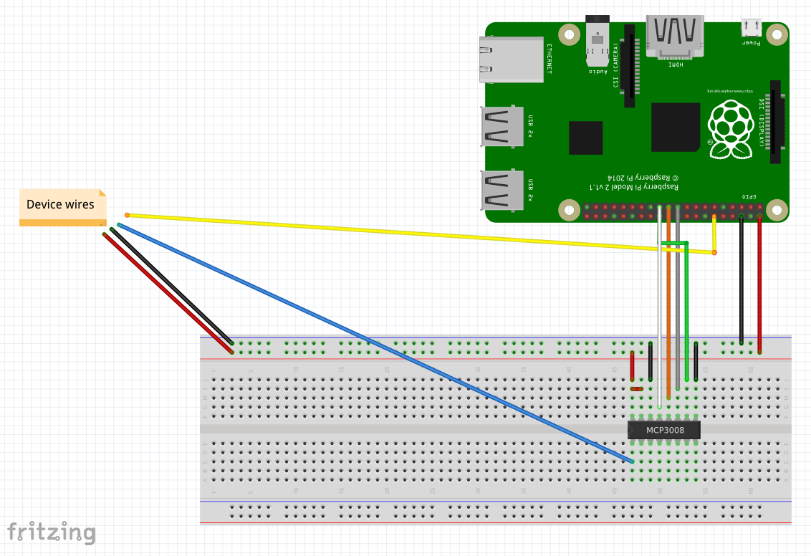

# Camel GP2Y1010AU0F component

Camel GP2Y1010AU0F component can read data from Compact Optical Dust Sensor. It is designed to work with GP2Y1010AU0F sensor type (https://www.sparkfun.com/datasheets/Sensors/gp2y1010au_e.pdf)

## Maven dependency

Maven users should add the following dependency to their POM file:

    <dependency>
      <groupId>io.rhiot</groupId>
      <artifactId>camel-gp2y1010au0f</artifactId>
      <version>${rhiot.version}</version>
    </dependency>

**Avaliable for `rhiot.version` >= 0.1.4**

## URI format

    gp2y1010au0f://name

The simplest way to read sensor data is to use following route:

    from("gp2y1010au0f://device1").to("mock:data");

## Options

| Option                   | Default value                                                                 | Description   |
|:-------------------------|:-----------------------------------------------------------------------       |:------------- |
| `consumer.delay`         | 5000 | Delay between each data read. |
| `channelId` | 0 | Spi interface channel id. |
| `iled`   | 1 | Sensor configuration pin (GPIO pin number). |
| `analogAddress` | 0 | A/D Converter analog channel id. |   

## SPI

To be able to use gp2y1010au0f component it is required to enable spi on your device. For Raspberry Pi following command can be used:

    raspbian-config-boot tparam=spi on

## A/D Converter

Because Raspberry Pi does not support analog inputs out of the box it is required to use some kind of converted (for instance https://www.adafruit.com/product/856)

## Wiring

Wiring for default component configuration:

