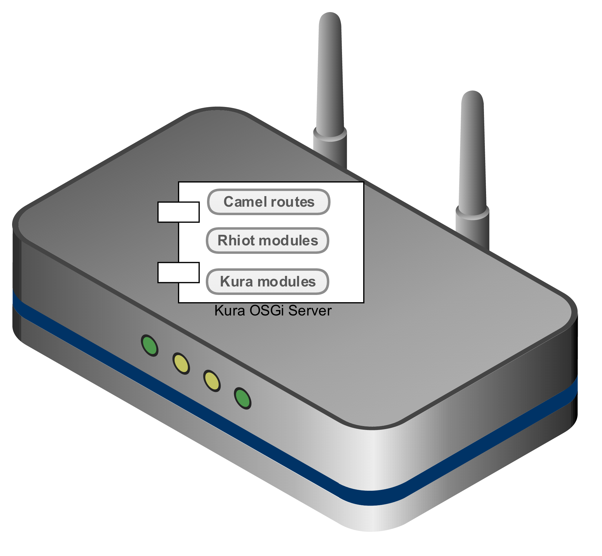
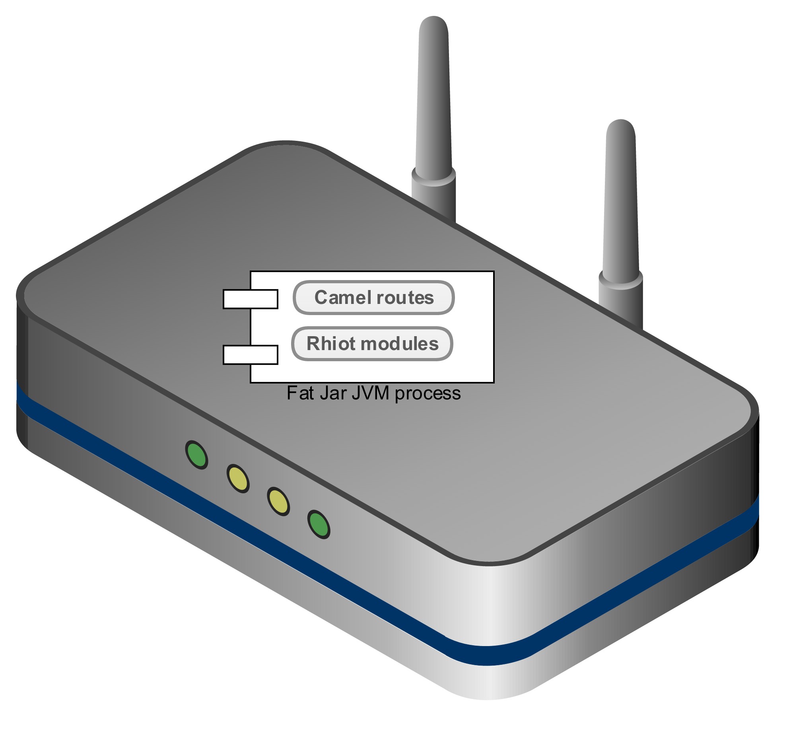

# Gateway

IoT field gateway is a small computer device deployed into a field and acting as a proxy between sensors and a data center.

Rhiot gateway support is primarily focused on providing some additional utilities to make working with 
[Eclipse Kura](https://www.eclipse.org/kura) based gateways easier. Kura has been proven to be a rock solid gateway
solution in many production installations. Rhiot supports [Kura 1.3.0](https://projects.eclipse.org/projects/iot.kura/releases/1.3.0).

The Rhiot's support for Kura is main focused on providing base [Camel Kura router](camel_kura_router.md) which can be 
extended to make development of Camel Kura modules easier. Rhiot comes with a set of additional IoT-focused 
[components](camel_components/index.md) for
Apache Camel. We also support a bunch of pretty useful tools, like [Rhiot command line tool](../tooling/cmd.md) or 
[interactive shell](../tooling/shell.md).

## Rhiot mini gateway

*Rhiot mini gateway* is a small fat jar application wrapping a subset of Kura functionalities. Its primary
target is to provide a rapid gateway software for makers and developers community. More details regarding Rhiot mini
gateway can be found [here](mini/index.md).

## Supported gateway platforms

Rhiot supports following gateway platforms:

- Raspberry Pi 2 B+ with Raspbian Jessie