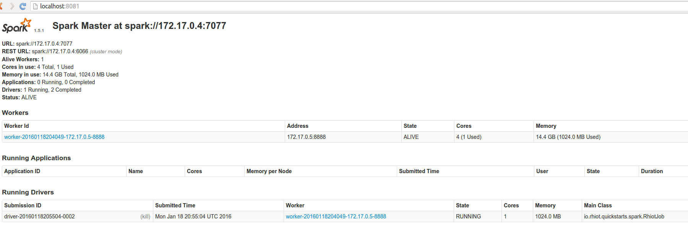

# Apache Spark quickstart

The Apache Spark quickstart can be used to create a
clustered [Spark Service](https://rhiot.gitbooks.io/rhiotdocumentation/content/cloudplatform/services/spark.html) application
driver wrapped into a long running [Camel Spark](http://camel.apache.org/apache-spark) job. This project contains a
samples of data sources and jobs definitions. Such job definitions can be invoked using
[Cloud Platform](https://rhiot.gitbooks.io/rhiotdocumentation/content/cloudplatform/cloudplatform.html) IoT Connector.

## Prerequisites

This quickstart is dedicated to be executed against the
[Cloud Platform PaaS](https://rhiot.gitbooks.io/rhiotdocumentation/content/cloudplatform/starting.html#paas).
Cloud platform PaaS comes with a pre-configured Apache Spark cluster, so make sure that PaaS has been properly started
before before proceeding with a deployment of this example. The PaaS platform can be started by executing the following
script:

    bash <(curl -L -s https://goo.gl/RQd9tJ)

## Installing quickstart

In order to install the quickstart execute the following commands:

    git clone git@github.com:rhiot/quickstarts.git
    cp -r quickstarts/spark spark
    cd spark
    mvn install
    sudo cp target/rhiot-spark-1.0.0-SNAPSHOT.jar /tmp/jobs/

## Deploying quickstart

To deploy the quickstart, execute the following command:

    bash <(curl -sL https://goo.gl/sQxjnE) --class io.rhiot.quickstarts.spark.RhiotJob /tmp/jobs/rhiot-spark-1.0.0-SNAPSHOT.jar

After you execute the command above, you should see your task deployed into Spark cluster:

## Invoking the deployed job

In order to invoke the deployed job using IoT Connector, you can use [REST protocol adapter](../adapters/rest.md) which
is included in the PaaS distribution. If you issue the following REST request, you should see results of
a job computation:

    curl http://localhost:8080/spark/execute/rdd/countAndMultiply/20
    {"payload":20}

In this particular example, we executed `countAndMultiply` job against RDD named `rdd` using `20` as an input data for
the job.